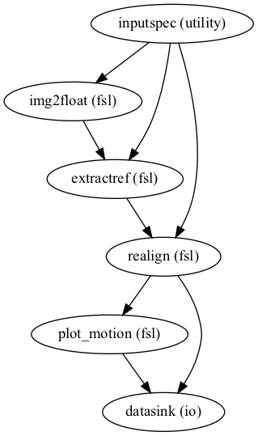
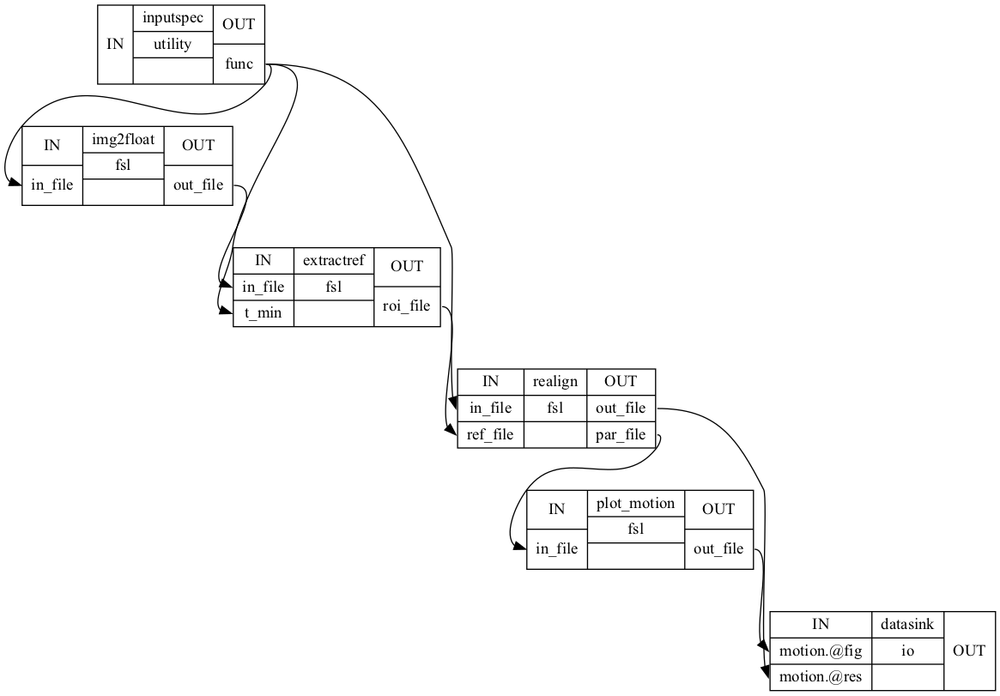

# fMRI-PhysioNoise

## Purpose

PhysioNoise is a tool for physiological noise correction of fMRI. The core model of this tool is based on the noise model from RETROICOR (Glover et al. 2000), including cardiac and respiration caused noise in fMRI image.

The main idea of PhysioNoise is to build a GLM with noise as main components. Noise components come from RETROICOR noise model and are used as regressors in GLM. The residual of GLM will be the corrected fMRI data for furthur use.

## Introduction

The pipeline of this tool is divided into three modules.

#### 1. Preprocess
   This module mainly focus on preparing a fMRI data for GLM analysis. The operations include skull stripping and motion correction.

   - [X] motion correction
   - [ ] registration to structural MRI
   - [ ] Stripping skull

   The pipeline of this step is shown in the figure below. After transfering image values to fload, the reference for motion correction is collected from the middle volume of fMRI. Applying motion correction to the raw data with the reference, which is also plotted by last step. The preprocess gives back the frameworks of workflow, the plots of motion correction and preprocessed data.

   

   The interfaces from the pipeline from the pipeline.

   

   - *Concern: Respiration noise is part of motion correction. Interesting respirtion noise in GLM might be partly removed by motion correction, which may influence the results for respiration components.*

#### 2. Get Regressors
   This module calculates regressors for the final GLM step. Since fMRI data is a sequence of volumn images of each scanning time, the regressors are respondingly calculated for each volumn. Based on the noise model from RETROICOR (Glover et al. 2000), regressors in PhysioNoise consist of cardiac and respiration regressors.

   According to RETROICOR model, physiological noise components can be expressed by a low order Fourier series expanded in terms of cardiac and respiration phases.

   

